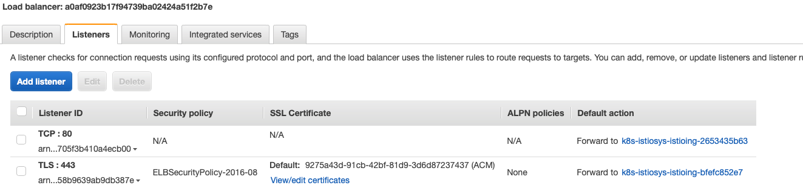
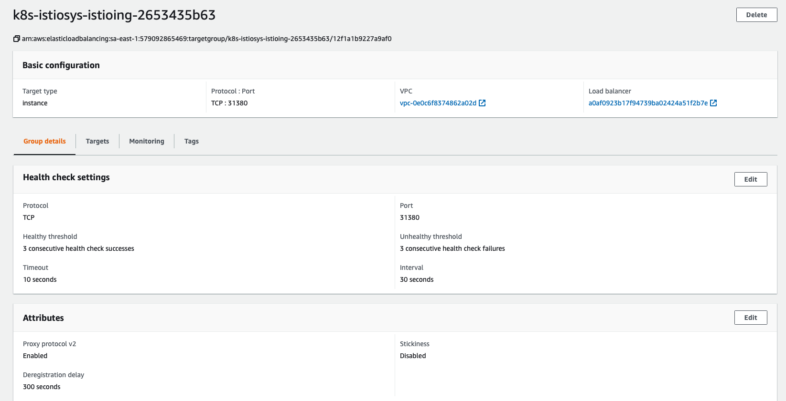
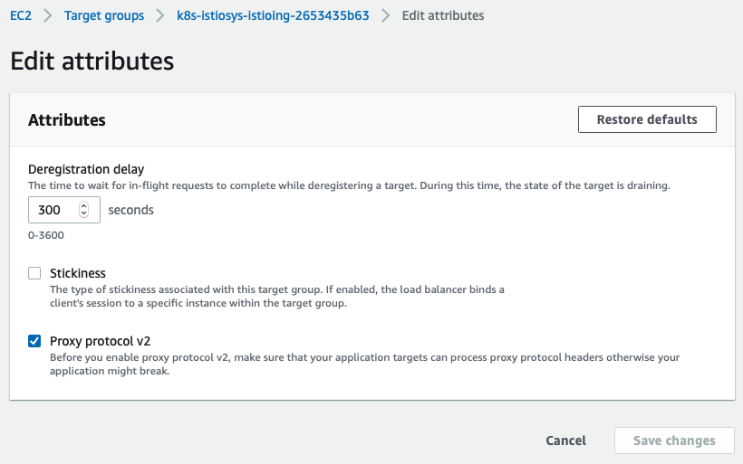

# Procedimento de configuração do PROXY PROTOCOL no Loabalancer AWS

## Serviço istio-ingressgateway

Adicionar as marcações:

* service.beta.kubernetes.io/aws-load-balancer-backend-protocol: http
* service.beta.kubernetes.io/aws-load-balancer-proxy-protocol: '*'
* service.beta.kubernetes.io/aws-load-balancer-ssl-cert: <CERT-ARN>
* service.beta.kubernetes.io/aws-load-balancer-ssl-ports: https
* service.beta.kubernetes.io/aws-load-balancer-type: nlb

## Gateway Istio

Alterar o listener da porta 443 para utilizar HTTP ao invés de HTTPS

```
apiVersion: networking.istio.io/v1beta1
kind: Gateway
metadata:
  name: tj-istio-gateway
  namespace: istio-system
spec:
  selector:
    istio: ingressgateway
  servers:
  - port:
      number: 80
      name: http
      protocol: HTTP
    hosts:
    - '*'
    tls:
      httpsRedirect: true
  - port:
      number: 443
      name: http-443
      protocol: HTTP
    hosts:
    - '*'
```

## Criação dos filtros do Envoy

```
apiVersion: networking.istio.io/v1alpha3
kind: EnvoyFilter
metadata:
  name: proxy-protocol
  namespace: istio-system
spec:
  configPatches:
  - applyTo: LISTENER
    patch:
      operation: MERGE
      value:
        listener_filters:
        - name: envoy.listener.proxy_protocol
  workloadSelector:
    labels:
      istio: ingressgateway
---
apiVersion: networking.istio.io/v1alpha3
kind: EnvoyFilter
metadata:
  name: fix-https-proto-misconfig
  namespace: istio-system
spec:
  filters:
  - filterConfig:
      inlineCode: |
        function envoy_on_request(request_handle)
          request_handle:headers():remove("X-Forwarded-Proto");
          request_handle:headers():add("X-Forwarded-Proto", "https");
        end
    filterName: envoy.lua
    filterType: HTTP
    listenerMatch:
      listenerType: ANY
      portNumber: 443
  workloadLabels:
    app: istio-ingressgateway
```
As motivações destes filtros são:
* Ativar proxy-protocol no envoy
* Corrigir a variável x-forwarded-proto que é adicionada incorretamente no listener HTTPS, pois a terminação está externa, no load balancer da AWS.

## Ativar proxy-protocol v2 nos target-groups do LoadBalancer

Acessar as propriedades do loadbalancer e listar os target groups


Acessar as propriedades do listener


Ativar proxy-protovol v2 em todos os listeners recém-criados.


Após estas alterações os backends deverão estar recebendo o ip de origem do request, tanto por http quando HTTPS.

## Débitos técnicos

* Ter que forçar http no listener da 443 do istio
* impossibilidade de usar https ou ssl na marcação `service.beta.kubernetes.io/aws-load-balancer-backend-protocol: http`